# 🎲 Cube Roll Puzzle

**Roll the cubes. Paint the board. Spend every move.**

An open-source hybrid-casual puzzle game built through a **simulated studio pipeline** —
from prototype to LiveOps, every stage a real studio would go through.

<!--  -->

> [!NOTE]
> **This project simulates a hybrid-casual studio pipeline.** All development is real; market and player data are simulated.
> Each stage is built the way a studio would build it, and every KPI gate is passed through a written scenario.

> [!IMPORTANT]
> **📍 Now:** Prototyping — step 1/7 · Board renders
> **Next:** A Freeform cube that rolls and paints

## 🗺️ Roadmap

```mermaid
flowchart LR
    subgraph CL ["Core Loop"]
        direction LR
        A["📋 Planning"] --> B["🧪 Prototype"] --> MT["🎬 Marketability"] --> H["🌾 Harvest"] --> C["⚙️ Game Logic"] --> D["🎨 Presentation"] --> E["✨ Polish & Juice"]
    end
    subgraph FX ["Fixed Order"]
        direction LR
        M1["🧱 M1 Foundation"] --> M2["🚪 M2 First Session"]
    end
    subgraph DD ["Data-Driven Order"]
        direction LR
        M3["🧩 M3 Meta & Economy"] --> M4["💰 M4 Monetization"] --> M5["📡 M5 LiveOps & Social"] --> S["🌍 Scale"]
    end
    CL --> FX --> DD

    classDef done fill:#2ea043,color:#fff,stroke:#2ea043
    classDef active fill:#d29922,color:#fff,stroke:#d29922
    classDef todo fill:#6e7681,color:#fff,stroke:#6e7681
    class A done
    class B active
    class MT,H,C,D,E,M1,M2,M3,M4,M5,S todo
```

| Stage | Question it answers | Status | Progress |
|---|---|---|---|
| 📋 Planning | What is the game? | ✅ Done | `██████████` 100% |
| 🧪 Prototype | Is it fun? | 🚧 In Progress | `░░░░░░░░░░` 0% (0/7) |
| 🎬 Marketability | Does it sell in 5 seconds? | ⏳ Planned | `░░░░░░░░░░` 0% (0/5) |
| 🌾 Harvest | What did we learn? | ⏳ Planned | `░░░░░░░░░░` 0% (0/3) |
| ⚙️ Game Logic | Are the rules correct and extensible? | ⏳ Planned | `░░░░░░░░░░` 0% (0/8) |
| 🎨 Presentation | Can the player see and play it? | ⏳ Planned | `░░░░░░░░░░` 0% (0/7) |
| ✨ Polish & Juice | Does it feel great? | ⏳ Planned | `░░░░░░░░░░` 0% (0/6) |
| 🧱 M1 Foundation | Can we measure and tune remotely? | ⏳ Planned | `░░░░░░░░░░` 0% (0/8) |
| 🚪 M2 First Session | Do players come back tomorrow? | ⏳ Planned | `░░░░░░░░░░` 0% (0/7) |
| 🧩 M3 Meta & Economy | Do they keep coming back this week? | ⏳ Planned | `░░░░░░░░░░` 0% (0/5) |
| 💰 M4 Monetization | Does each player generate value? | ⏳ Planned | `░░░░░░░░░░` 0% (0/4) |
| 📡 M5 LiveOps & Social | Can we keep them for months? | ⏳ Planned | `░░░░░░░░░░` 0% (0/5) |
| 🌍 Scale | Can content keep up? | ⏳ Planned | `░░░░░░░░░░` 0% (0/3) |

---

## 🎮 Core Loop

Click a tab to open it. Opening one closes the others in this group.

<b>🎮 The Game</b>

 

Cubes sit on a 4×4 grid, each with a move counter. Rolling paints the cells a cube touches, and **painted cells are permanently blocked**.
You win when **every cell is painted and every counter is zero**. Undo and reset are free.

| Cube | Moves | Behavior |
|---|---|---|
| 🟦 **Freeform** | N | One cell per move. Tap a cell or drag a path. Pushes Light Cubes. |
| 🟥 **Roller** | N | Rolls until blocked. The whole run costs 1 move. |
| ⬜ **Light Cube** | 0 | Never paints. Moves only when pushed, must end on a painted cell. |

| | Costs a move | Paints | Visual |
|---|:---:|:---:|---|
| **Rolling** | ✅ | ✅ | Tumbles |
| **Being pushed** | ❌ | ❌ | Slides flat |

<b>🧪 Prototype</b> — 0/7

 

**Goal:** find out if the mechanic is fun, as fast as possible. The output is **knowledge, not code** — no architecture, no tests, every feel value exposed in the Inspector.

- [ ] Board renders
- [ ] Freeform cube rolls on tap and paints
- [ ] Drag-path input
- [ ] Win / loss, undo, reset
- [ ] Light Cube & pushing
- [ ] Roller
- [ ] Hand-built test boards

**Questions it must answer**

| # | Question | Answer |
|---|---|---|
| 1 | Does the roll feel good? | ⏳ |
| 2 | Tap or drag — which controls feel right? | ⏳ |
| 3 | Is the exact move budget interesting or just restrictive? | ⏳ |
| 4 | Is pushing Light Cubes actually fun? | ⏳ |
| 5 | Does the Roller create an "I should have moved that first" moment? | ⏳ |

Findings → [`FINDINGS.md`](Assets/Prototype/FINDINGS.md)

<b>🎬 Marketability Test</b> — 0/5

 

**Goal:** check whether the mechanic reads instantly in a short, silent clip — before investing in production.

- [ ] Hook analysis: what makes a viewer stop scrolling
- [ ] 3 short ad creatives (different hooks)
- [ ] Store icon & screenshot concepts
- [ ] Simulated CTR / CPI test plan & results
- [ ] Go / iterate decision

**Why it matters:** in hybrid-casual, the core mechanic *is* the ad. A fun game that can't be shown in 5 seconds is expensive to acquire players for.

<!-- Creatives: docs/media/creatives/ -->

<b>🌾 Harvest</b> — 0/3

 

**Goal:** turn prototype knowledge into a production spec.

- [ ] Settled rules & tuning values from `FINDINGS.md`
- [ ] Data shapes & rejected ideas
- [ ] Retire prototype code — read as a spec, **never migrated**

<b>⚙️ Game Logic</b> — 0/8

 

**Goal:** rebuild the rules from scratch as a pure C# core that is correct, tested and ready for new content after soft launch.

- [ ] Board model & cell states
- [ ] Rolling & painting rules
- [ ] Cube behaviors as extensible types
- [ ] Push & interaction resolution
- [ ] Win / loss evaluation
- [ ] Undo & reset
- [ ] Level definition model
- [ ] Copyable board state (solver-ready)

**Why it's built this way**
- **No `UnityEngine` in the core** — enforced by assembly definitions, so rules are tested without opening Unity.
- **New cube types plug in** — adding one means adding a behavior, not editing existing rules.
- **Every phase ships with unit tests**, then gets a hand review for readability. Refining, not premature optimization.

<b>🎨 Presentation</b> — 0/7

 

**Goal:** connect the tested core to Unity with a thin, replaceable view layer.

- [ ] Composition root & scene bootstrap
- [ ] Board & cell views
- [ ] Cube views mapped per cube type
- [ ] Input layer: tap, drag path, direction
- [ ] Roll & slide animations driven by core events
- [ ] HUD: counters, undo, reset
- [ ] Win & fail screens

**Why it's built this way**
- **Views are dumb** — they display state and forward input. No game rules in a MonoBehaviour.
- **Look can change without touching logic** — visuals and input can be swapped after playtests or A/B tests.

<b>✨ Polish & Juice</b> — 0/6

 

**Goal:** make every roll, push and win feel satisfying.

- [ ] Roll & slide feel: timing, easing, squash & stretch
- [ ] Paint fill effect
- [ ] Selection feedback, legal-move highlights, path preview
- [ ] Haptics & SFX
- [ ] Win celebration & fail feedback
- [ ] On-device performance check

**Why it's built this way**
- **Juice is modular** — each effect reacts to game events and can be tuned or turned off from data.
- **Feel values live in config, not code.**

---

## 🚀 Beyond the Core Loop

M1–M2 follow a fixed order. From M3 on, the order can change based on data — see **Decision Gates**.

<b>🧱 M1 · Foundation</b> — 0/8

 

**Question:** Can we measure and tune the game remotely?

- [ ] Service layer & composition root (interfaces + null providers)
- [ ] Save system & player profile data
- [ ] App flow: boot → loading → home → game
- [ ] Analytics integration & event plan
- [ ] Remote Config & feature flags
- [ ] Crash reporting
- [ ] Level editor & solvability check
- [ ] CI build pipeline (GameCI)

🚦 **Gate:** all analytics events validated end to end

<b>🚪 M2 · First Session</b> — 0/7

 

**Question:** Do players come back tomorrow?

- [ ] FTUE: Freeform → Light Cube → Roller
- [ ] Level progression & chapters
- [ ] Home screen (Play + Settings)
- [ ] Difficulty & level order via Remote Config
- [ ] Interstitial ads with remote frequency
- [ ] Localization
- [ ] Accessibility: shape-based cube readability

🚦 **Gate:** D1 ≥ 40% (simulated) · clean tutorial funnel

<b>🧩 M3 · Meta & Economy</b> — 0/5

 

**Question:** Do they keep coming back this week?

- [ ] Soft currency & level rewards
- [ ] Hint system & hint economy
- [ ] Daily reward & streak
- [ ] Shop → **tab bar appears**
- [ ] Collection

🚦 **Gate:** D7 ≥ 15% (simulated)

<b>💰 M4 · Monetization</b> — 0/4

 

**Question:** Does each player generate value?

- [ ] Rewarded ads for hints
- [ ] IAP: no-ads, starter pack, bundles
- [ ] GDPR / ATT consent flow
- [ ] A/B tests on offers & ad placements

🚦 **Gate:** LTV supports CPI (simulated)

> Hints are sold, **never extra moves** — extra moves break the budget design.

<b>📡 M5 · LiveOps & Social</b> — 0/5

 

**Question:** Can we keep players for months?

- [ ] Daily puzzle
- [ ] Skill layer: time, no-undo bonus or gems
- [ ] Weekly tournament & leaderboard
- [ ] Profile screen
- [ ] Events calendar

🚦 **Gate:** D30 ≥ 6% (simulated)

<b>🌍 Scale</b> — 0/3

 

**Question:** Can content production keep up with players?

- [ ] Solver & level generator (state-space search)
- [ ] New cube types & cell modifiers
- [ ] Teams / social *(only if data supports it)*

<b>🩺 Decision Gates</b>

 

**Loop:** Measure → Diagnose → Decide → Build → Measure

| Decision | When |
|---|---|
| ✅ **Go** | Gate passed, move to the next milestone |
| 🔁 **Iterate** | Close to the gate, fix the leak and measure again |
| 🔀 **Pivot** | One part performs, the rest doesn't |
| ❌ **Kill** | Retention doesn't move after several iterations |

**Fixed order:** measurability → stability → first session → monetization only after retention stabilizes.

**What changes the order**

| Signal | Diagnosis | Moves up |
|---|---|---|
| Tutorial drop-off | Players don't get it | FTUE rework |
| Churn spike at a level | Difficulty spike | Level order, hints |
| Good D1, weak D7 | No reason to return | Meta (M3) |
| Undo / reset loops | Players get stuck | Hint economy |
| Interstitial hurts D1 | Ads too early | Ad timing via Remote Config |

**Planned analytics events**
`tutorial_step` · `level_start` · `level_complete` · `level_fail` · `moves_left_on_fail` · `undo_used` · `reset_used` · `time_to_solve` · `hint_used` · `ad_shown`

**Simulated scenario log**

| Milestone | Signal | Decision | Action | Result |
|---|---|---|---|---|
| — | — | — | — | ⏳ |

<b>🛠️ How I Work</b>

 

| | 🧪 Prototype | 🏗️ Production |
|---|---|---|
| **Purpose** | Is it fun? | Build it to last |
| **Output** | Knowledge | Shippable code |
| **Folder** | `Assets/Prototype/` (excluded from builds) | `Assets/Scripts/` |
| **Architecture** | None, speed first | Pure C# core + thin Unity layer |
| **Tests** | None | Unit tests every phase |
| **Progress** | One playable step at a time | One tested, reviewed phase at a time |

**Principles**
- Small phases: each one is playable or tested before the next begins.
- Build for the changes that are coming: new cubes, new cells, new visuals, new services.
- Simplest working solution first; patterns only when a real problem appears.
- Decisions come from data, not momentum.
- No performance claims without measurement.

---

MIT License · Made with Unity by <a href="https://github.com/Kutanarcan">Kutanarcan</a>
